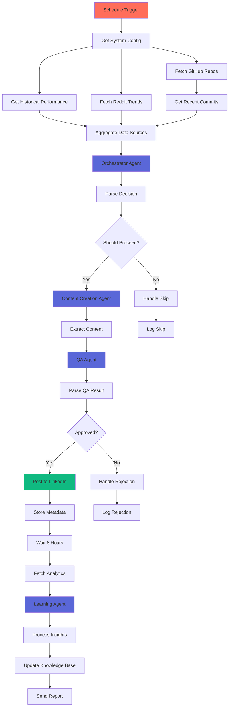

# 🤖 Agentic AI LinkedIn Automation System

<div align="center">


**An autonomous multi-agent system that creates, optimizes, and learns from LinkedIn content about Agentic AI**

[Features](#-features) • [Architecture](#-architecture) • [Installation](#-installation) • [Configuration](#-configuration) • [Usage](#-usage) • [Roadmap](#-roadmap)

</div>

---

## ⚠️ Development Status

> **🚧 This project is currently under active development and is NOT production-ready.**
> 
> - Features may be incomplete or change without notice
> - APIs and configurations are subject to breaking changes
> - Testing coverage is limited
> - Documentation may be outdated
> 
> **Use at your own risk. Contributions and feedback are welcome!**

---

## 📋 Table of Contents

- [Overview](#-overview)
- [Features](#-features)
- [Architecture](#-architecture)
- [Prerequisites](#-prerequisites)
- [Installation](#-installation)
- [Configuration](#-configuration)
- [Usage](#-usage)
- [Agent Descriptions](#-agent-descriptions)
- [Data Flow](#-data-flow)
- [Troubleshooting](#-troubleshooting)
- [Roadmap](#-roadmap)
- [Contributing](#-contributing)
- [License](#-license)

---

## 🎯 Overview

This n8n workflow implements a **fully autonomous agentic AI system** that:

1. 🔍 Monitors Reddit for trending Agentic AI topics
2. 📊 Tracks your GitHub repositories for recent work
3. 🧠 Uses Claude Sonnet 4 agents to make strategic decisions
4. ✍️ Creates engaging LinkedIn posts automatically
5. 📈 Analyzes performance and learns from results
6. 🎓 Provides personalized skill development recommendations

The system operates autonomously, making intelligent decisions without human intervention while continuously improving through machine learning.

---

## ✨ Features

### 🤖 Multi-Agent System
- **Orchestrator Agent**: Strategic decision-making and resource allocation
- **Content Strategy Agent**: Analyzes trends and scores content opportunities
- **Content Creation Agent**: Generates engaging LinkedIn posts
- **QA Agent**: Ensures quality, safety, and brand alignment
- **Learning Agent**: Analyzes performance and provides insights

### 🧠 Intelligent Capabilities
- ✅ Autonomous decision-making with confidence thresholds
- ✅ Multi-source data aggregation (Reddit, GitHub, Historical Data)
- ✅ Real-time trend analysis
- ✅ Performance prediction and tracking
- ✅ Continuous learning and optimization
- ✅ Self-correcting quality gates

### 🛡️ Production Features
- ✅ Error handling and recovery
- ✅ Retry logic with exponential backoff
- ✅ Email notifications for all states
- ✅ Comprehensive logging
- ✅ Database-backed persistence
- ✅ Configurable via REST API

### 📊 Analytics & Insights
- ✅ Post performance tracking
- ✅ Prediction accuracy monitoring
- ✅ Skill development recommendations
- ✅ Industry trend identification
- ✅ Automated intelligence reports

---

## 🏗️ Architecture


### Agent Flow Diagram
```
┌─────────────────────────────────────────────────────────────┐
│                    ORCHESTRATOR AGENT                        │
│  • Analyzes all data sources                                │
│  • Makes strategic decisions                                │
│  • Sets confidence levels                                   │
└────────────────────┬────────────────────────────────────────┘
                     │
                     ▼
         ┌──────────────────────┐
         │  Confidence >= 70%?  │
         └──────┬───────────┬───┘
                │           │
          YES   │           │   NO
                ▼           ▼
         ┌──────────┐   ┌──────────┐
         │ CONTENT  │   │   SKIP   │
         │ STRATEGY │   │  & LOG   │
         └────┬─────┘   └──────────┘
              │
              ▼
         ┌──────────────────┐
         │  CONTENT CREATOR │
         │  • Generates post │
         └────┬─────────────┘
              │
              ▼
         ┌──────────────────┐
         │    QA AGENT      │
         │  • Reviews        │
         │  • Validates      │
         └────┬─────────────┘
              │
              ▼
         ┌──────────────────┐
         │  Quality >= 70%? │
         └──┬───────────┬───┘
            │           │
      YES   │           │   NO
            ▼           ▼
         ┌──────┐   ┌──────────┐
         │ POST │   │  REJECT  │
         │  TO  │   │  & LOG   │
         │ LNKD │   └──────────┘
         └──┬───┘
            │
            ▼
         ┌──────────────────┐
         │  WAIT 6 HOURS    │
         └────┬─────────────┘
              │
              ▼
         ┌──────────────────┐
         │ LEARNING AGENT   │
         │  • Analyzes       │
         │  • Learns         │
         │  • Recommends     │
         └──────────────────┘
```

---

## 📦 Prerequisites

### Required Software
- [n8n](https://n8n.io/) (v1.0.0+)
- Node.js (v18+)
- Database (PostgreSQL, MySQL, or MongoDB)

### Required API Keys & Credentials

| Service | Purpose | How to Get |
|---------|---------|------------|
| **Anthropic API** | Claude Sonnet 4 agents | [Get API Key](https://console.anthropic.com/) |
| **Reddit OAuth2** | Fetch trending posts | [Create App](https://www.reddit.com/prefs/apps) |
| **GitHub OAuth2** | Monitor repositories | [Create OAuth App](https://github.com/settings/developers) |
| **LinkedIn OAuth2** | Post content | [LinkedIn Developers](https://www.linkedin.com/developers/) |
| **SMTP Email** | Send reports | Your email provider |

### Optional Services
- REST API endpoint for configuration storage
- Database for historical data
- Monitoring service (optional)

---

## 🚀 Installation

### Step 1: Clone the Repository
```bash
git clone https://github.com/yourusername/agentic-ai-linkedin.git
cd agentic-ai-linkedin
```

### Step 2: Import Workflow to n8n

1. Open your n8n instance
2. Click **"Import from File"** or **"Import from URL"**
3. Select `workflow.json`
4. Click **"Import"**

### Step 3: Install Dependencies (if self-hosting n8n)
```bash
npm install n8n
npm install -g n8n
```

### Step 4: Start n8n
```bash
# Local development
n8n start

# Production with tunnel
n8n start --tunnel

# Docker
docker run -it --rm \
  --name n8n \
  -p 5678:5678 \
  -v ~/.n8n:/home/node/.n8n \
  n8nio/n8n
```

---

## ⚙️ Configuration

### Step 1: Configure Credentials in n8n

Navigate to **Settings → Credentials** and add:

#### 1. Anthropic API
```
Name: Anthropic API
API Key: your-anthropic-api-key
```

#### 2. Reddit OAuth2
```
Name: Reddit account
Client ID: your-reddit-client-id
Client Secret: your-reddit-client-secret
Redirect URL: https://your-n8n-instance.com/rest/oauth2-credential/callback
```

#### 3. GitHub OAuth2
```
Name: GitHub account
Client ID: your-github-client-id
Client Secret: your-github-client-secret
Scope: repo, user
```

#### 4. LinkedIn OAuth2
```
Name: LinkedIn account
Client ID: your-linkedin-client-id
Client Secret: your-linkedin-client-secret
Scope: w_member_social
```

#### 5. SMTP Email
```
Name: Email account
Host: smtp.gmail.com (or your provider)
Port: 587
User: your-email@example.com
Password: your-app-password
```

### Step 2: Set Up Configuration Endpoint

Create a REST API endpoint that returns:
```json
{
  "databaseUrl": "https://your-api.com",
  "githubUsername": "your-github-username",
  "userEmail": "your-email@example.com",
  "fromEmail": "noreply@yourdomain.com"
}
```

**Update the URL in the "Get System Config" node:**
```javascript
// Change this URL in the workflow
"url": "https://your-api.com/config"
```

### Step 3: Set Up Database Endpoints

Your API should support these endpoints:
```
GET  /config                    # System configuration
GET  /performance?days=30       # Historical performance data
POST /posts                     # Store post metadata
POST /learning                  # Store learning insights
POST /skipped                   # Log skipped posts
POST /rejected                  # Log rejected content
POST /errors                    # Log errors
```

**Example Database Schema:**
```sql
-- Posts table
CREATE TABLE posts (
  id UUID PRIMARY KEY,
  post_id VARCHAR(255),
  content TEXT,
  strategy JSONB,
  qa_score INTEGER,
  timestamp TIMESTAMP,
  run_id VARCHAR(255)
);

-- Learning table
CREATE TABLE learning (
  id UUID PRIMARY KEY,
  run_id VARCHAR(255),
  insights JSONB,
  metrics JSONB,
  post_id VARCHAR(255),
  timestamp TIMESTAMP
);

-- Performance table
CREATE TABLE performance (
  id UUID PRIMARY KEY,
  post_id VARCHAR(255),
  likes INTEGER,
  comments INTEGER,
  shares INTEGER,
  impressions INTEGER,
  timestamp TIMESTAMP
);
```

### Step 4: Configure Workflow Schedule

In the **"Schedule Trigger"** node, set your preferred frequency:
```
Default: Every 12 hours
Recommended: Every 24 hours
Minimum: Every 6 hours (to avoid rate limits)
```

---

## 🎮 Usage

### Running the Workflow

#### Manual Execution
1. Open the workflow in n8n
2. Click **"Execute Workflow"** button
3. Monitor execution in real-time

#### Automatic Execution
The workflow runs automatically based on the schedule trigger (default: every 12 hours)

### What Happens During Execution
```
1. ⏰ Trigger fires at scheduled time
2. 🔍 System fetches:
   - Reddit trending topics (Agentic AI subreddit)
   - Your GitHub repository activity
   - Historical performance data
3. 🧠 Orchestrator Agent decides:
   - Should we post? (confidence threshold)
   - What topic is most relevant?
   - What angle will perform best?
4. ✍️ Content Creation Agent:
   - Generates LinkedIn post
   - Incorporates your actual work
5. ✅ QA Agent reviews:
   - Brand safety check
   - Quality score (must be >= 70%)
   - Grammar and clarity
6. 📤 Posts to LinkedIn (if approved)
7. ⏳ Waits 6 hours for engagement
8. 📊 Fetches analytics
9. 🎓 Learning Agent analyzes:
   - What worked and why
   - What to improve
   - Skill recommendations
10. 📧 Sends you intelligence report
```

### Understanding Agent Decisions

#### Orchestrator Agent Output
```json
{
  "decision": "proceed",
  "confidence": 85,
  "selectedTopic": "Multi-agent systems in production",
  "contentAngle": "Practical implementation challenges",
  "expectedEngagement": 120,
  "reasoning": "Topic shows high Reddit engagement and aligns with your recent GitHub commits"
}
```

#### Learning Agent Output
```json
{
  "performanceAnalysis": {
    "actualVsPredicted": {"predicted": 120, "actual": 145},
    "accuracy": 92
  },
  "skillRecommendations": [
    {
      "skill": "LangGraph for agent orchestration",
      "priority": "high",
      "reasoning": "Trending topic with 3 high-engagement Reddit posts",
      "projects": ["Build multi-agent task planner"],
      "resources": ["LangGraph documentation", "Agent patterns blog"]
    }
  ]
}
```

---

## 🤖 Agent Descriptions

### 1. Orchestrator Agent
**Role:** Strategic Decision Maker

**Responsibilities:**
- Analyzes all available data sources
- Determines if conditions are favorable for posting
- Selects the best content angle
- Predicts expected engagement
- Sets confidence levels for decisions

**Decision Criteria:**
- Historical performance trends
- Current industry buzz on Reddit
- Your recent GitHub activity relevance
- Time since last post
- Content saturation analysis

---

### 2. Content Strategy Agent
**Role:** Content Analyst (currently integrated into Orchestrator)

**Responsibilities:**
- Scores content opportunities
- Identifies trending topics
- Evaluates alignment with user's expertise
- Recommends optimal timing

---

### 3. Content Creation Agent
**Role:** Content Writer

**Responsibilities:**
- Generates LinkedIn posts
- Incorporates user's actual work
- Maintains authentic voice
- Follows LinkedIn best practices
- Includes relevant hashtags

**Output Format:**
- Hook (1-2 sentences)
- Main content (3-4 paragraphs)
- Call-to-action
- 3-5 hashtags

---

### 4. QA Agent
**Role:** Quality Assurance

**Responsibilities:**
- Brand safety check
- Factual accuracy verification
- Grammar and clarity review
- Engagement potential assessment
- Hashtag appropriateness

**Quality Gates:**
- Minimum quality score: 70/100
- Zero brand safety issues
- Professional tone maintained

---

### 5. Learning Agent
**Role:** Continuous Improvement

**Responsibilities:**
- Analyzes post performance
- Identifies success factors
- Provides skill recommendations
- Updates content strategy
- Tracks prediction accuracy

**Outputs:**
- Performance analysis report
- Top 3 skills to focus on
- Trending topics for your niche
- Specific project recommendations
- Learning resources

---

## 🔄 Data Flow

### Input Sources
```
┌─────────────────┐
│  Reddit API     │──┐
│  (Hot topics)   │  │
└─────────────────┘  │
                     │
┌─────────────────┐  │    ┌──────────────────┐
│  GitHub API     │──┼───▶│  Data Aggregator │
│  (Your repos)   │  │    └────────┬─────────┘
└─────────────────┘  │             │
                     │             ▼
┌─────────────────┐  │    ┌──────────────────┐
│  Database       │──┘    │  Agent Pipeline  │
│  (History)      │       └────────┬─────────┘
└─────────────────┘                │
                                   ▼
                          ┌──────────────────┐
                          │  LinkedIn API    │
                          │  (Post content)  │
                          └────────┬─────────┘
                                   │
                                   ▼
                          ┌──────────────────┐
                          │  Learning DB     │
                          │  (Insights)      │
                          └──────────────────┘
```

### Agent Communication Flow
```
Orchestrator ────decision────▶ Content Creator
                                     │
                                     ▼
                          ┌──────────────────┐
                          │   Generated      │
                          │   Content        │
                          └────────┬─────────┘
                                   │
                                   ▼
QA Agent ◀────review────────────────
     │
     ▼
┌─────────────┐
│  Approval   │──Yes──▶ LinkedIn
│  Decision   │
└─────────────┘
     │
     No
     ▼
Rejection Handler
```

---

## 🐛 Troubleshooting

### Common Issues

#### 1. Workflow Not Triggering
**Symptoms:** Schedule doesn't fire

**Solutions:**
```bash
# Check n8n is running
ps aux | grep n8n

# Verify schedule trigger is active
# In n8n UI: Check "Active" toggle on workflow

# Check n8n logs
tail -f ~/.n8n/logs/n8n.log
```

#### 2. Authentication Errors
**Symptoms:** "401 Unauthorized" errors

**Solutions:**
- Verify all credentials are properly configured
- Check OAuth scopes are correct
- Regenerate tokens if expired
- Ensure redirect URLs match exactly

#### 3. Agent Not Responding
**Symptoms:** Anthropic API errors

**Solutions:**
```javascript
// Check API key is valid
// Verify model name is correct: "claude-sonnet-4-20250514"
// Check rate limits: https://console.anthropic.com/

// Test API directly:
curl https://api.anthropic.com/v1/messages \
  -H "anthropic-version: 2023-06-01" \
  -H "x-api-key: YOUR_KEY" \
  -H "content-type: application/json" \
  -d '{"model":"claude-sonnet-4-20250514","max_tokens":1024,"messages":[{"role":"user","content":"Hello"}]}'
```

#### 4. Low Confidence / Skipped Posts
**Symptoms:** Posts always skipped

**Solutions:**
- Lower confidence threshold (currently 70%)
- Check if Reddit API is returning data
- Verify GitHub repos are public
- Review historical performance data

#### 5. Database Connection Errors
**Symptoms:** "Failed to store data" errors

**Solutions:**
```bash
# Test database endpoint
curl https://your-api.com/config

# Check database is running
# Verify connection string
# Review API logs for errors
```

### Debug Mode

Enable detailed logging:

1. In each HTTP Request node, enable **"Response" > "Include Response Headers"**
2. Add **"Code"** nodes after critical steps with:
```javascript
// Debug logging
console.log('Node output:', JSON.stringify($input.all(), null, 2));
return $input.all();
```

### Getting Help

- 📖 [n8n Documentation](https://docs.n8n.io/)
- 💬 [n8n Community Forum](https://community.n8n.io/)
- 🐛 [Open an Issue](https://github.com/yourusername/agentic-ai-linkedin/issues)
- 📧 Email: your-email@example.com

---

## 🗺️ Roadmap

### ✅ Current Features (v0.1.0-alpha)
- [x] Multi-agent system with 5 specialized agents
- [x] Reddit trend monitoring
- [x] GitHub activity tracking
- [x] Autonomous posting to LinkedIn
- [x] Performance analytics
- [x] Learning and recommendations

### 🚧 In Progress
- [ ] Web interface for configuration
- [ ] A/B testing for content variations
- [ ] Multi-platform support (Twitter, Medium)
- [ ] Advanced analytics dashboard

### 📋 Planned Features (v0.2.0)
- [ ] Voice and tone customization
- [ ] Image generation for posts
- [ ] Video content creation
- [ ] Community engagement automation
- [ ] Competitor analysis
- [ ] SEO optimization

### 🔮 Future Vision (v1.0.0)
- [ ] Multi-language support
- [ ] Cross-platform content syndication
- [ ] Advanced ML for trend prediction
- [ ] Collaborative filtering
- [ ] API for external integrations
- [ ] Mobile app for monitoring

### 🎯 Research & Experiments
- [ ] Fine-tuned models for your specific domain
- [ ] Reinforcement learning for content optimization
- [ ] Graph neural networks for trend prediction
- [ ] Federated learning across users

---

## 🤝 Contributing

We welcome contributions! This project is open for:

- 🐛 Bug reports
- ✨ Feature requests
- 📝 Documentation improvements
- 🔧 Code contributions

### How to Contribute

1. **Fork the repository**
```bash
git clone https://github.com/yourusername/agentic-ai-linkedin.git
cd agentic-ai-linkedin
```

2. **Create a feature branch**
```bash
git checkout -b feature/amazing-feature
```

3. **Make your changes**
```bash
# Edit files
# Test thoroughly
```

4. **Commit with clear messages**
```bash
git commit -m "Add: Amazing new feature"
```

5. **Push to your fork**
```bash
git push origin feature/amazing-feature
```

6. **Open a Pull Request**
- Describe what you changed and why
- Link any relevant issues
- Add screenshots if applicable

### Contribution Guidelines

- Follow existing code style
- Add tests for new features
- Update documentation
- Keep commits atomic and focused
- Write clear commit messages

### Code of Conduct

- Be respectful and inclusive
- Provide constructive feedback
- Focus on the issue, not the person
- Help create a welcoming environment

---

<div align="center">

**⭐ Star this repo if you find it useful!**

**Made with ❤️ and 🤖 by the Agentic AI Community**

[⬆ Back to Top](#-agentic-ai-linkedin-automation-system)

</div>
